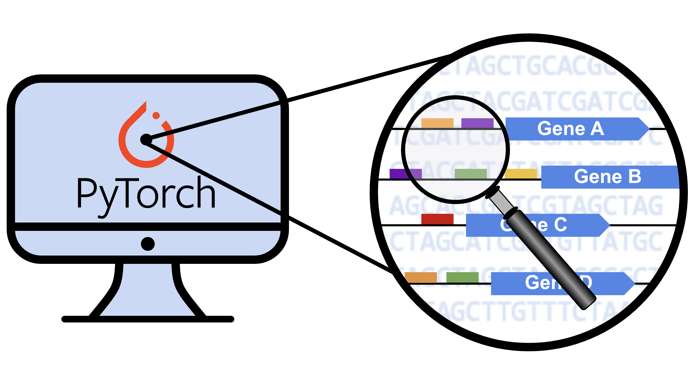

# dna-pytorch-tutorial



A very basic tutorial on how to create a Pytorch model that takes DNA sequences as input.

See tutorial notebook [here](https://github.com/erinhwilson/dna-pytorch-tutorial/blob/main/basic_DNA_tutorial.ipynb).

### conda env set up example
```
conda create -n dna python=3
conda install -c anaconda numpy pandas seaborn scikit-learn jupyter
conda install -c conda-forge matplotlib altair
conda install pytorch
conda install -c bioconda logomaker
```
